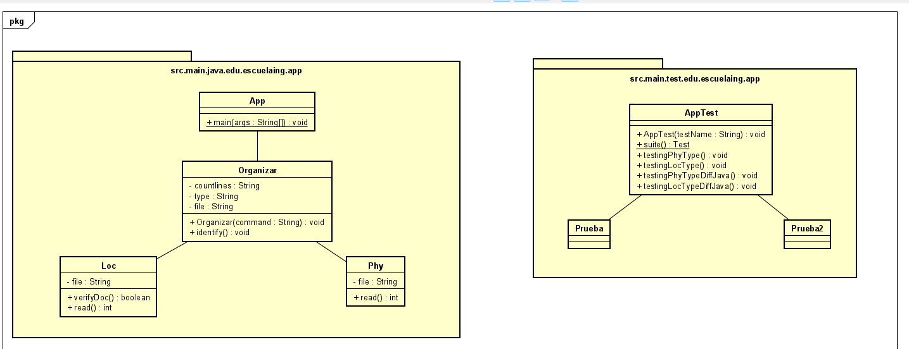
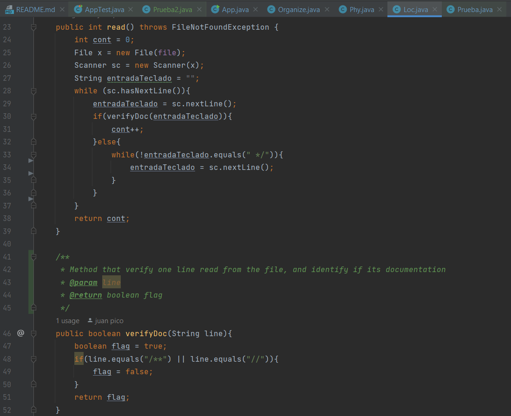
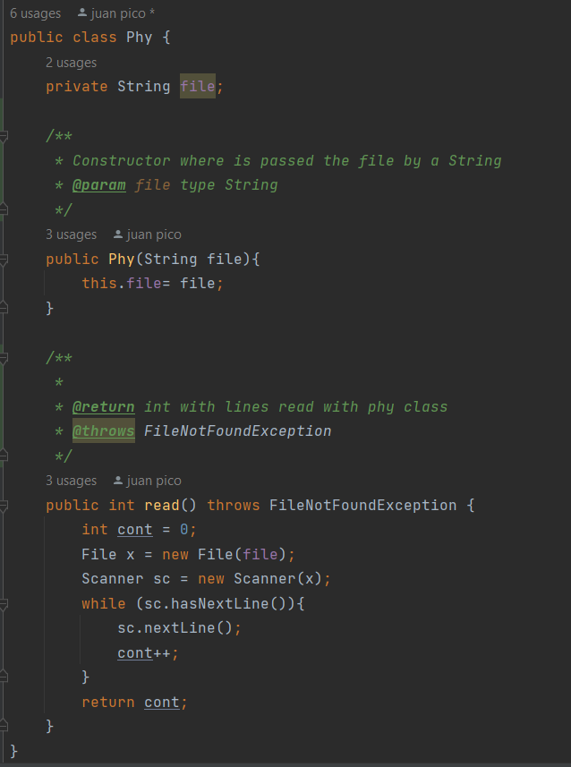

# ARSWI_LOC-Counting
## Author 
**Juan Andrés Pico** 
## Fecha
**9/06/22**
## Introducción
En ente laboratorio se busca hacer un codigo que  genere el numero de lineas que tiene un codigo o un archivo, teniendo como entrada solo una linea de codigo Ej  `> countlines phy countline.java`</s>

## Class diagram
Para el modelado del problema se diseño el siguiente diagrama de clases que se dividio en los test y el programa donde se corre que se llama App.

## Description of class diagram
En el el directorio `src.main.java.edu.escuelaing.app`, se encuentra la clase principal con el metodo main llamada App.
Este metodo crea un objeto Organize el cual dependiendo de la entrada que ingrese la persona en App, tomara la decision por el metodo `identify()` de si es un Loc o un Phy para empezar el conteo del archivo.
### If its Loc
Si se identifico en Organizar que el conteo es de tipo Loc,por el metodo `read` y `verifyDoc` no se contaran las lineas de codigo que estan documentadas y retornara un tipo entero.

### If its Phy
Si se identifico en Organizar que el conteo es de tipo Phy, la clase retorna por el metodo `read` todas las lineas contando las documentadas.

## LOC/h.
+ Entendimiento del problema: **30 minutos**
+ Diseño del problema: **30 minutos**
+ Programación: **3 Horas**
+ Pruebas: **30 minutos**
+ Escritura del informe: **30 minutos** 
